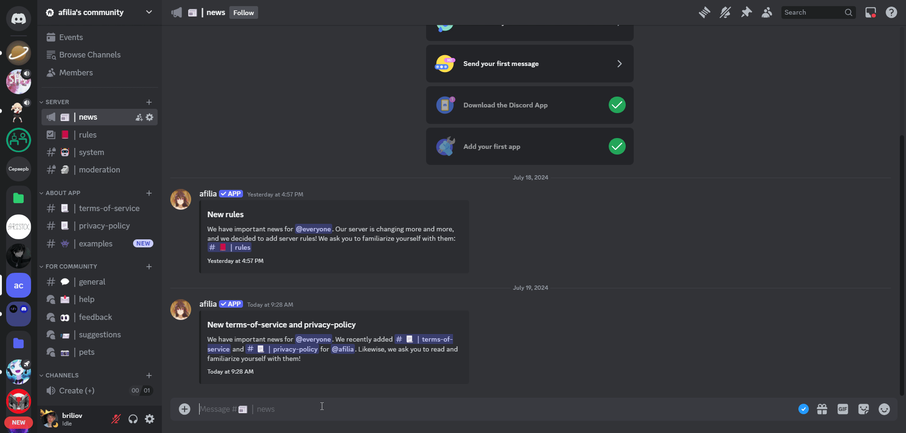
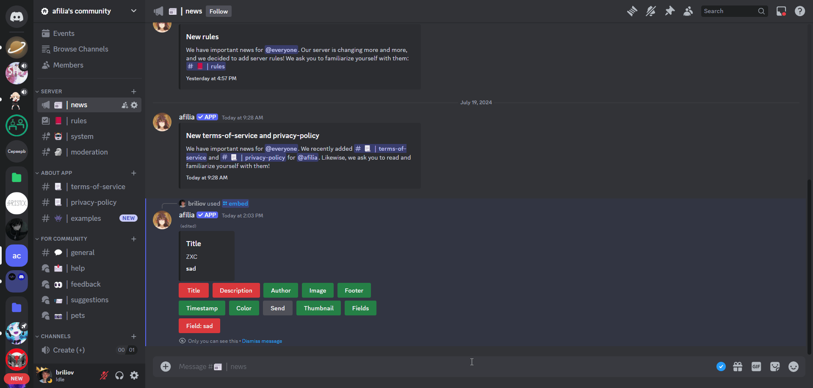
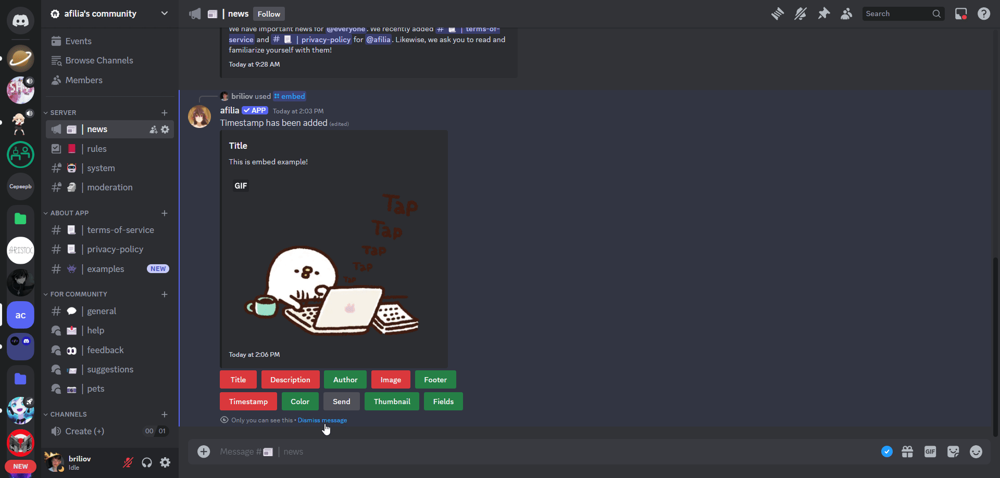
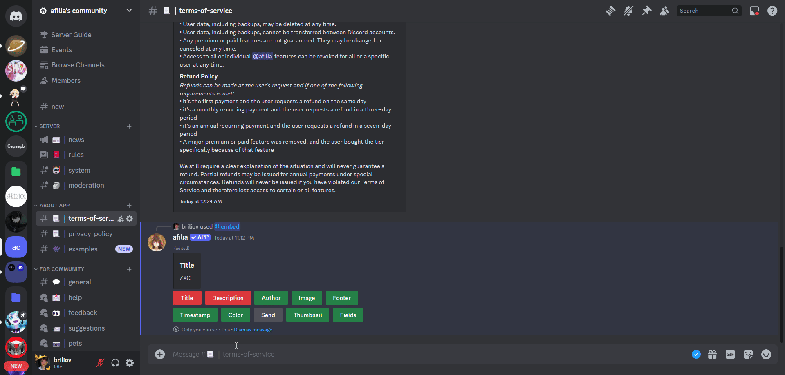

# EmbedGenerator
EmbedGenerator is a free, open-source, extensible bot for Discord servers, built on top of <a href="https://github.com/DisnakeDev/disnake">disnake.py</a>. This bot is generally self-hosted either on a dedicated server (like a Raspberry Pi) or general cloud hosting like AWS etc. You can think of this bot as privacy focused, as you are in total control of the code, so you can be sure that your information is secure.

## Features:
This bot has been in development since 2024 and has only two command:

### General Commands

- `/help` -> Examples of bot usage.
- `/embed` -> Returns a view modal to setting and send embed

### Usage examples

`First steps:`  
To get started, you need to use /embedTo get started, you need to use /embed  

`Add something:`   
To add something, you need to click a button and fill out the modal window  

`Delete something:`  
To delete something, you need to click a button  

`Send embed:`  
To send embed, you need to click button and choose method for send.  

If you choose “Send this channel”, embed will be sent in this channel.  

If you choose “Use webhook” you will need to past webhook URL.  

`Input errors:`  
You don’t have to worry about data entry errors, because if they are not true, _**EmbedGenerator**_ will warn you!  

## Installation

This bot runs on [Python](https://www.python.org/). You will need at least python 3.10.

### Windows

1. Install [Python](https://www.python.org/)
2. Activate venv in console `python -m venv venv`
3. Install all needed packages `pip install -r requirements.txt`. You can also delete `requirements.txt` after.
4. Configurate `.env` (Add your token).
5. Run `python main.py` to start bot.

### Running longterm
Once you've setup your keys and checked that the features you want are working, you have a couple of options for running the bot.

### Selfhosted
You could run the bot along side everything else on your pc. However it's probably a good idea to run your bot on a separate computer such as a linux server or a Raspberry Pi so it does not interfere with your normal operations and to keep it running even if you were to sleep or shutdown your PC. 

### Cloud Hosted
There is a number of cloud hosting providers that can run small Python applications like this. The following have been tested to work, you'll have to extrapolate if you want to use some other provider (AWS, etc)

### Running on Heroku
- Create heroku account, install heroku-cli, create a new Dyno.
- Git clone the repo and follow the instructions in the Deploy section to setup pushing to heroku
- Go to settings and setup Config Vars the name of the vars are exactly the same as the auth.json file. You **DO NOT** need the quotes around the values in config vars
- Run `heroku scale worker=1` in the bot installation directory to run the bot as a worker rather than a webserver.

